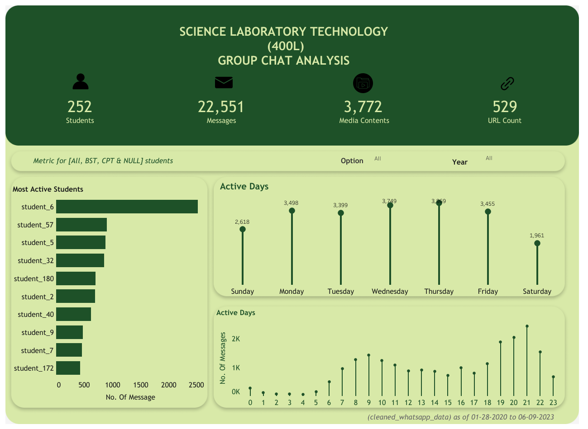

# WhatsApp Group Chat Analysis
    
Text data from a whatsapp group chat is used to create a dashboard in **Tableau**. The data is cleaned and transformed with **Python**, the cleaned data is then saved and exported as a CSV file to **Tableau** to create a dashboard. This project involves analysing a departmental class group chat(**General** group chat) that's having three options in it and those options have their own group chats, this Options are the **BST**, **CPT** & **MBT** 
The documentation includes:
- Aims and objectives
- Data gathering 
- Data cleaning
- Designing of dashboard
- Insights
- Conclusion

## Aims and objectives

The aim of this project is to see how different options interact in the **General** group chat. The optional group chat would be used to obtain the distinct students(users) that would be used to match that of the **General** group chat, this is to obtain the options of each student in it.

## Data gathering 

In obtaining the WhatsApp chat data, I exported the chat without media, from the WhatsApp group of interest by navigating the right top corner of the group chat and selecting **Export Chat**.
The WhatsApp Chat data was collected from 3 students, the "WhatsApp_Chat_with_UJ_2017_NS_SLT.txt"(**General** group chat for all options) and "WhatsApp_Chat_with_UJ_NS_SLT_CPT.txt"(for the **CPT** option) was collected from one student while  the "WhatsApp Chat with S L T (MBT) option unijos.txt"(for the **MBT** option) and "WhatsApp Chat with B. S. T FAMILY.txt"(for the **BST** option) was collected from two other students.

## Data cleaning

- The libraries or packages to be used are imported into the python environment
- A function called **wrangle** is created, this function does the following;
    - Takes in a parameter "file_path" which is the The path to the WhatsApp chat text file.
    - Reads and process the WhatsApp chat text file into a string.
    - It uses regular expressions to extract dates and split messages into user and message content and store the results in a dictionary,
      which is converted into a dataframe.
    - The resulting DataFrame contains columns for date, user, message, and URLCount (count of URLs in the message), The date column is
      converted to a datetime type.
    - **Note**: The function assumes that the chat text file follows a specific format where messages are preceded by dates
      and have a specific structure with usernames followed by a colon and a space.
- Contacts that are saved with names in the **MBT** & **BST** dataframe are replaced with their respective phone numbers.
- A function called **option_column** is created, this function does the following;
    - Takes in two parameter "dataframe" and "string".
    - This function filters out rows where the user is 'group_notification' from the DataFrame.
    - Creates an 'Option' column in the DataFrame with a specified option for each user.
    - Returns a dataframe with two columns which are the "user" and "option".
- The function **option_column** would be applied on the **BST**, **CPT** & **MBT** group chat dataframes, this obtain the users with their 
  respective options to be merged(joined) with the dataframe of the **General** group chat to obtain the option of each student(user).
- Messesages with users as 'group_notification'are filtered out and a new column is created (student_id) which gives an **ID** for each 
  unique user.
- The dataframe is then saved as a **CSV** file.

## Designing of dashboard

The cleaned data is then exported to **Tableau** in order explore, create visualisation and build an interactive dashboard.

You can click on this [Link](https://public.tableau.com/app/profile/israel.joseph/viz/SCIENCELABORATORYTECNOLOGYWHATSAPPGROUPCHATANALYSIS/Dashboard1) to explore the dashboard.

## Insights

- Student_6 is the most active student in the group chat
- Wednesdays and Thursdays are the most active days
- 8pm and 9pm are the most active hours
- 37 students do not belong in any of the optional group chat

## Conclusion

The aims and objectives were obtained at the end of the project, but the WhatsApp text files would not be made available.
    
